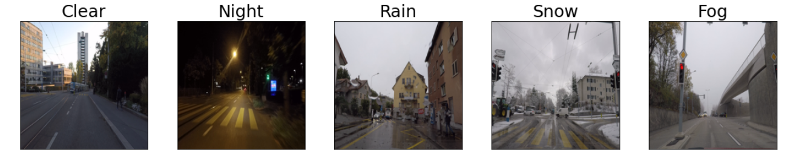

# Valeo Weather Classification
Classifying street-level images according to weather to help the training of autonomous vehicles

## Current strategy
Simple CNNs with eventual Dropout trained on a sampled mix between the ACDC and the BDD datasets

## Performance
- 94.8% on day/night
- 70.2% on clear/rain/snow
- non evaluated on nofog/fog
- models/version_control.txt for an accurate description of performance

## Work in progress
- increase performance on day/night using a non-ML approach
- the low performance on precipiation is due to the inconsistent labelling in BDD (dataset_images/bdd_snow.PNG), we are currently cleaning the dataset

## Setup
- clone the repository
- pip install requirements.txt

## Run
- Put images to test in the inference_images folder
- Run inference.py
- The results will be saved in inference_results.csv