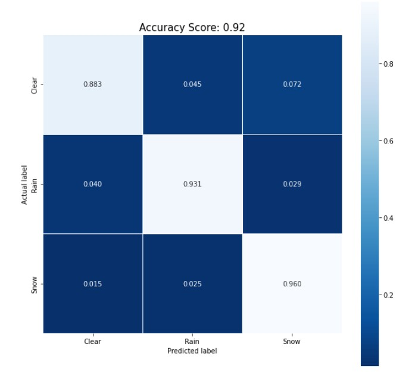

# Weather Classification
Classifying street-level images according to weather to help the training of autonomous vehicles. This work has been done as a student project for Valeo

## Strategy
- **Day/Night**: RandomForest on average RGB and HSV values
- **Clear/Rain/Snow**: Simple CNN with Dropout
- **NoFog/Fog**: Simple CNN

Training on a mix between two manually cleaned datasets:
- **ACDC** ( https://acdc.vision.ee.ethz.ch/ )
- **Berkeley DeepDrive** ( https://bdd-data.berkeley.edu/ )

## Performance

On our TEST dataset (ACDC/BDD):
- **Day/Night**: 97.8% accuracy ( Human Level Performance = 100% )
- **Clear/Rain/Snow**: 92.0% accuracy ( HLP = 96% )
- **NoFog/Fog**: not enough data to train and evaluate
  
Here is the Clear/Rain/Snow confusion matrix

On unseen datasets:
(dataset and results can be found in inference_images and inference_results.csv)

- **Mapillary**: 73% accuracy on 19 images
- **Valeo Woodscape**: 40% accuracy on 10 images

This shows a very high training/serving skew that indicates that the models must be retrained on images captured in the same way as the inference images, as images from different datasets are too far from each other for a deep learning approach (example: observe the differences between a bdd and a woodscape image in the folder "inference_images"). Maybe a more robust, non-DL approach would have been enough.

## Setup
- clone the repository
- pip install -r requirements.txt

## Run
- Put images to test in the inference_images folder
- Run inference.py
- The results will be saved in inference_results.csv
