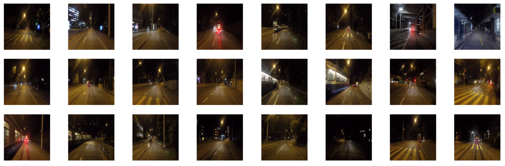

# Valeo Weather Classification
Classifying street-level images according to weather to help the training of autonomous vehicles

## Training dataset
The training set used is the ACDC dataset, accuracy is over 95% on all tasks on the validation set

We are currently creating a test set

The labels are:
- **clear**:

- **night**:

- **rain**:

- **snow**:

- **fog**:

## Setup
- clone the repository
- pip install requirements.txt

## Run
- Put images to test in the inference_images folder
- Run inference.py
- The results will be saved in inference_results.csv